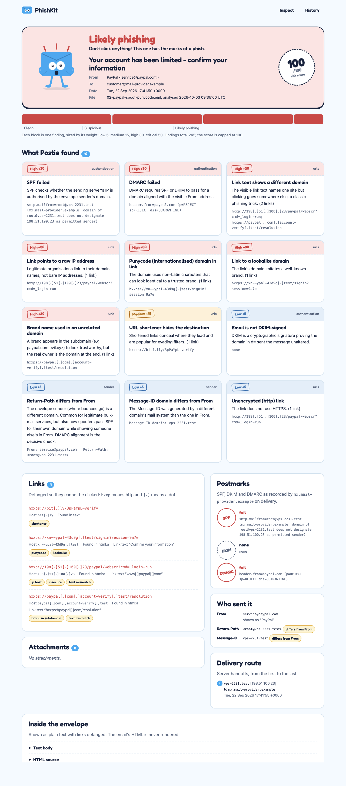
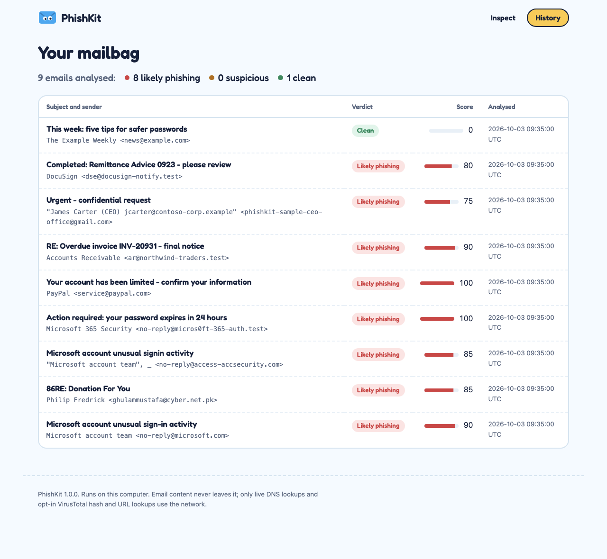

# PhishKit: Phishing Email Analysis Toolkit

PhishKit takes a saved email (`.eml`) and does the first-pass triage a SOC analyst would do:
it reads the authentication results, compares every sender identity, pulls out and scores
every link, hashes every attachment, and explains each finding in plain language. It runs as
a **command-line tool** and as a **local web app** with a dashboard of past analyses.



## What it checks

| Area | Checks |
|---|---|
| **SPF / DKIM / DMARC** | Parses the `Authentication-Results`, `ARC-Authentication-Results` and `Received-SPF` headers stamped by the receiving server, trusting only the topmost one, which an attacker cannot forge. Optional `--live` mode re-verifies against DNS: it evaluates SPF for the originating IP, cryptographically re-verifies DKIM signatures, and fetches the DMARC policy and checks alignment. |
| **Sender mismatches** | From vs Reply-To, Return-Path, Sender and Message-ID domains. Display names that impersonate a brand (`"PayPal" <x@evil.ru>`) or embed another address. Lookalike domains (`paypa1`, `rnicrosoft`, punycode homoglyphs, `brand-secure-login`). Free webmail posing as an internal team. |
| **Suspicious URLs** | Extracted from text and HTML (`<a>`, forms, meta refresh, iframes). Flags link text that shows a different domain, raw IPs, punycode, lookalikes, brands in subdomains (`paypal.com.evil.test`), `@` tricks, shorteners, free hosting and tunnels, high-abuse TLDs, `javascript:`/`data:` links and HTML forms. Every URL is **defanged** (`hxxps://evil[.]com`). |
| **Attachments** | MD5, SHA1 and SHA256. The real file type is identified from magic bytes and compared with the extension. Flags double extensions (`invoice.pdf.exe`), right-to-left-override filenames, executables and scripts, ISO/IMG containers, macro-enabled Office files (OOXML `vbaProject.bin` and OLE2), encrypted or risky archives, HTML smuggling and credential-form attachments, and PDFs with active content. |
| **Threat intel (optional)** | `--vt` looks up attachment hashes and URLs on VirusTotal when `VT_API_KEY` is set. Only hashes and URLs are sent, never the email. |

Each finding carries a severity weight (low 5, medium 15, high 30, critical 50). The total,
capped at 100, gives the verdict: **Clean** (0–19), **Suspicious** (20–49) or **Likely phishing** (50+).

## Quick start

Requires Python 3.10+.

```bash
git clone https://github.com/ketanabhishek8/Phishing-Email-Analysis.git
cd Phishing-Email-Analysis
python3 -m venv .venv
source .venv/bin/activate
pip install -r requirements.txt
```

### Command line

```bash
python -m phishkit analyze samples/03-invoice-macro-attachment.eml
python -m phishkit analyze suspicious.eml --live          # re-check SPF/DKIM/DMARC via DNS
python -m phishkit analyze suspicious.eml --json > report.json
python -m phishkit analyze samples/*.eml                  # batch
```

Exit codes make it scriptable: `0` clean, `1` suspicious, `2` likely phishing, `3` error.

```text
PhishKit report
Verdict: Likely phishing   Risk score: 90/100  ██████████████████░░

── Authentication ────────────────────────────────────────────────────────────
  Checked by    mx.fabrikam.example
  SPF           pass  smtp.mailfrom=northwind-traders.test
  DKIM          pass  northwind-traders.test=pass
  DMARC         pass  action=none header.from=northwind-traders.test

── Attachments (1) ───────────────────────────────────────────────────────────
  • Invoice_INV-20931.docm  (744 bytes, detected: ooxml)
      MD5     aeba64c8b247c088ef337a539328d19f
      SHA1    c4ac209d9f4b6f7064b313147e5dbbc4d326705b
      SHA256  972ce090b87418a2bb7f9a232dd5876c9b2a07eb40110f24a252d0018260699f
      flags: risky_extension, macros

── Findings (3) ──────────────────────────────────────────────────────────────
  [HIGH] Reply-To differs from From
      Replies will go to a different organisation than the visible sender.
      This is the core trick in business email compromise (BEC) and invoice
      fraud. Replies go to a free webmail account.
  [HIGH] Risky attachment type
  [HIGH] Office document contains macros
```

Note that SPF, DKIM and DMARC all **pass** here: this models a compromised supplier
mailbox, and authentication only proves which domain sent the message, not that it is safe.

### Web app

```bash
python -m web            # http://127.0.0.1:5000
```

Upload an `.eml` file, or click one of the bundled samples. Tick the boxes to add live DNS or
VirusTotal checks. Every analysis is kept in a local SQLite database and listed on the dashboard.

| Upload | Dashboard |
|---|---|
|  |  |

There is also a JSON API:

```bash
curl -F file=@suspicious.eml http://127.0.0.1:5000/api/analyze          # stateless, not saved
curl -F file=@suspicious.eml "http://127.0.0.1:5000/api/analyze?live=1"
curl http://127.0.0.1:5000/api/report/3                                  # a saved report
```

To enable VirusTotal, get a free API key and start the app (or CLI) with
`VT_API_KEY=your-key python -m web`. The free tier allows 4 lookups per minute; PhishKit
stops cleanly and says so when it hits the limit.

## Samples

`samples/` contains six emails modelled on real techniques. All attacker infrastructure uses
reserved names (`.test`, `.example`, RFC 2606) and documentation IP ranges (RFC 5737). The
"malicious" attachments are inert stand-ins, such as a Word file containing a dummy macro part.
Two links use real platforms (a random `web.app` subdomain and a `bit.ly` path) because the
free-hosting and shortener checks need them; they point at nothing.
Regenerate them with `python scripts/make_samples.py`.

| Sample | Technique | Verdict |
|---|---|---|
| `01-m365-credential-harvest` | Lookalike sender, link text showing `login.microsoftonline.com` but pointing at a free-hosting page | Likely phishing (100) |
| `02-paypal-spoof-punycode` | Direct spoof of `paypal.com` (SPF and DMARC fail), punycode, raw-IP and brand-in-subdomain links | Likely phishing (100) |
| `03-invoice-macro-attachment` | Compromised supplier, Reply-To swap, macro-enabled `.docm` | Likely phishing (90) |
| `04-bec-ceo-fraud` | CEO fraud from Gmail, address inside the display name, Reply-To to Outlook | Likely phishing (75) |
| `05-html-smuggling` | DocuSign lookalike with an HTML attachment that builds a file via `atob`/`Blob` | Likely phishing (80) |
| `06-legit-newsletter` | Properly authenticated newsletter | Clean (0) |

To test against real-world phishing, `python scripts/fetch_corpus.py` downloads ten emails from
the public [Phishing Pot](https://github.com/rf-peixoto/phishing_pot) honeypot corpus
(CC BY-NC 4.0) into `samples/corpus/`. That folder is git-ignored, so live phishing content is
not republished here. Exports from LetsDefend or your own mailbox can go in the same folder.

The full walkthrough, including results on the real corpus, is in
**[docs/sample-analyses.md](docs/sample-analyses.md)**. How organisations defend against
phishing is covered in **[docs/defending-against-phishing.md](docs/defending-against-phishing.md)**.

## Design

```
phishkit/
  parser.py        .eml bytes -> ParsedEmail (forgiving: phishing is often malformed on purpose)
  auth.py          recorded SPF/DKIM/DMARC + live checks       spf.py, dmarc.py, dnsutil.py
  senders.py       identity consistency and display-name spoofing
  urls.py          link extraction, heuristics, defanging
  attachments.py   hashing, magic-byte typing, delivery-technique checks
  intel.py         optional VirusTotal enrichment
  domains.py       org domains, IDN/homoglyph and brand-lookalike helpers
  scoring.py       weights -> score -> verdict
  analyzer.py      runs every module and builds the Report
  render.py, cli.py
web/               Flask app, SQLite store, templates, CSS (no external assets)
```

Each analysis module takes the parsed email and returns `(section_data, findings)`, so modules
are independent and tested in isolation. `dnsutil` is the only code that touches DNS, and the
tests replace it with an in-memory resolver.

### The tool handles hostile input, so it is built defensively

- The email's HTML is **never rendered**. It is shown only as escaped source, with Jinja autoescaping on.
- URLs, hosts and link text from the email are defanged and never emitted as links.
- A strict Content-Security-Policy is applied (`default-src 'self'`, no inline script, no external assets), along with `X-Frame-Options: DENY`, `nosniff` and `no-referrer`.
- Every form post carries a CSRF token. The JSON API is stateless, so a cross-site request cannot write to the database.
- Uploads are capped at 10 MB, read in memory and never written to disk. Attachments are never executed.
- The web app binds to `127.0.0.1` only.
- Network access happens only when asked for (`--live`, `--vt`).

## Tests

```bash
python -m unittest discover -s tests -t . -v
```

148 tests run fully offline. They include an SPF evaluator test matrix (include
chains, redirect, loops, the lookup limit, timeouts), real DKIM sign-and-verify with a
throwaway key, Flask route and escaping tests, and end-to-end verdicts for every sample.

## Limitations

- Heuristics produce false positives and negatives; the score is triage guidance, not proof.
  Pure social-engineering emails (a plain-text request with no links, attachments or identity
  tricks) can score low because PhishKit does not judge the wording.
- The brand list covers about 20 frequently impersonated brands. Brands outside it (for
  example regional banks) are not checked for display-name impersonation.
- The live DKIM check fails on old emails if the sender has since rotated keys; this is
  reported as "key unavailable", not as a failure.
- Organisational-domain logic uses a built-in subset of the Public Suffix List.
- The SPF evaluator does not support the `exists` and `ptr` mechanisms or macros; such records
  evaluate to `neutral` with a note.
- Microsoft 365 rewrites Message-IDs, so the "Message-ID domain differs" check (low weight) is
  noisy for mail that passed through Exchange Online.

## Licence

MIT. See [LICENSE](LICENSE). The optional Phishing Pot corpus is CC BY-NC 4.0 and is not included.
