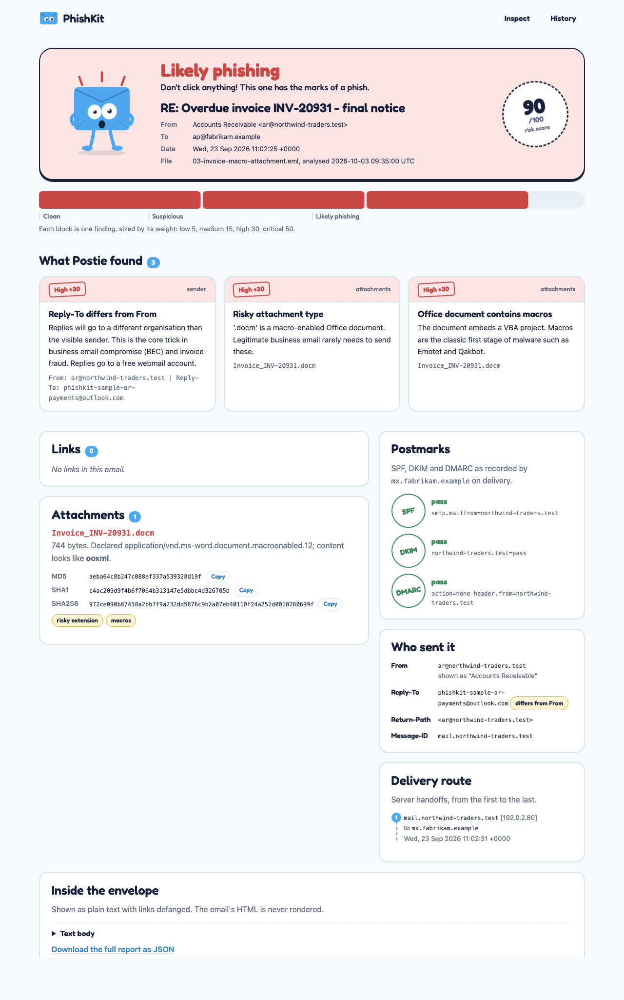
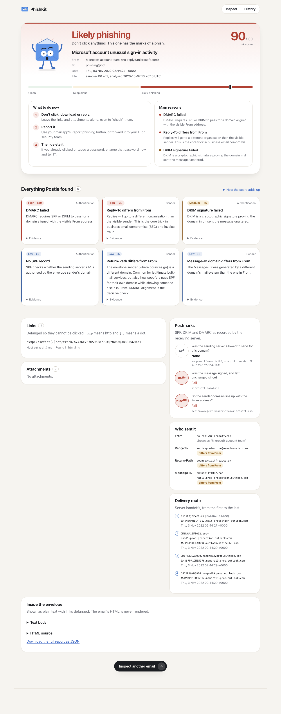

# Sample analyses

This document walks through PhishKit's output on two sets of emails:

1. **Six crafted samples** (`samples/`), each built around one real phishing technique, with
   the analyst reasoning behind each finding.
2. **Ten real phishing emails** from the public Phishing Pot honeypot corpus, to show how the
   tool behaves on messy real-world mail, including where it falls short.

Domains and URLs from real phishing are defanged (`[.]`). Crafted samples use reserved
`.test`/`.example` domains and RFC 5737 documentation IPs.

To reproduce: `python -m phishkit analyze samples/*.eml`, and for the corpus,
`python scripts/fetch_corpus.py` then `python -m phishkit analyze samples/corpus/*.eml`.

---

## Part 1: crafted samples

### 01: Microsoft 365 password-expiry lure (credential harvesting)

**Verdict: Likely phishing, 100/100**

| Finding | Weight | Evidence |
|---|---|---|
| Lookalike sender domain | critical | `micros0ft-365-auth.test`: a zero for the "o", plus a brand-and-keyword construction |
| Link text shows a different domain | high | Text says `https://login.microsoftonline.com/reset`, link goes to `hxxps://m365-reset-7731[.]web[.]app/login?u=j.smith@…` |
| Link hosted on a free hosting platform | medium | `web.app` (Firebase Hosting) |
| Not DKIM-signed, no DMARC policy | low | The attacker's own domain has no DMARC record |
| Return-Path and Message-ID differ from From | low | Bulk-mailer infrastructure `mailer-srv.test` |

**Analyst notes.**
- SPF *passes*. The attacker registered `mailer-srv.test` and published SPF for it. SPF only
  says "this server may send for the envelope domain"; it says nothing about the From address
  the victim sees. DMARC is the control that ties the two together, and the lookalike domain
  simply publishes no DMARC policy.
- The victim's address is embedded in the URL (`?u=j.smith@…`) so the fake login page can
  pre-fill it. This is a common credential-harvesting tell, and it also shows the campaign is
  targeted.
- **Response:** block the sender domain and the `web.app` URL at the gateway and proxy, search
  mailboxes for the same sender or URL, and reset credentials for anyone who clicked.

### 02: PayPal spoof with punycode links (direct domain spoofing)

**Verdict: Likely phishing, 100/100** (findings total 245 before the cap)

| Finding | Weight | Evidence |
|---|---|---|
| SPF failed | high | `vps-2231.test` does not designate `198.51.100.23` |
| DMARC failed | high | `header.from=paypal.com (p=REJECT …)` |
| Link text shows a different domain | high | Text `www.paypal.com` points at `hxxp://198[.]51[.]100[.]23/paypal/webscr…` |
| Raw IP in link | high | as above |
| Punycode domain / lookalike link | high | `xn--ypal-43d9g.test` decodes to `раypal.test` (Cyrillic `р` and `а`) |
| Brand used in unrelated domain | high | `paypal[.]com[.]account-verify[.]test`: the registered domain is `account-verify.test` |
| URL shortener | medium | `hxxps://bit[.]ly/3pPaYpL-verify` |

**Analyst notes.**
- The From header is literally `service@paypal.com`. Most mail clients show it as PayPal, but
  the receiving server recorded `dmarc=fail` against PayPal's `p=reject` policy. A correctly
  configured gateway would have rejected this. If it arrived, check whether DMARC enforcement
  is turned off or overridden by an allow-list rule.
- Three different URL obfuscation tricks in one email (homoglyph, IP, brand-as-subdomain) is
  typical of phishing kits that rotate techniques to beat URL reputation.

### 03: Overdue invoice with a macro document (compromised supplier)

**Verdict: Likely phishing, 90/100**

| Finding | Weight | Evidence |
|---|---|---|
| Reply-To differs from From | high | From `ar@northwind-traders.test`, Reply-To `phishkit-sample-ar-payments@outlook.com` |
| Risky attachment type | high | `.docm`, a macro-enabled Word document |
| Office document contains macros | high | OOXML package contains `word/vbaProject.bin` |



Attachment hashes (stable, because the generator is deterministic):

```
Invoice_INV-20931.docm  744 bytes  detected: ooxml
MD5     aeba64c8b247c088ef337a539328d19f
SHA1    c4ac209d9f4b6f7064b313147e5dbbc4d326705b
SHA256  972ce090b87418a2bb7f9a232dd5876c9b2a07eb40110f24a252d0018260699f
```

**Analyst notes.**
- **SPF, DKIM and DMARC all pass.** That is the point of this sample: the message genuinely
  came from the supplier's domain, which is what happens when a supplier's mailbox is
  compromised. Authentication proves origin, not intent.
- Two signals remain: the Reply-To diverts replies to a free Outlook account (so the attacker
  keeps the conversation even if the real owner resets their password), and the body asks the
  reader to "Enable Content" while announcing changed bank details. That combination is
  classic vendor email compromise and invoice fraud.
- **Response:** submit the SHA256 to the sandbox and threat-intel platform, quarantine all
  copies, call the supplier on a known phone number (never one from the email), and flag any
  pending payments to them.

### 04: CEO wire-transfer request (business email compromise)

**Verdict: Likely phishing, 75/100**

| Finding | Weight | Evidence |
|---|---|---|
| Reply-To differs from From | high | Gmail sender, Outlook Reply-To |
| Display name contains a different email address | high | Display name `James Carter (CEO) jcarter@contoso-corp.example`, actual address `phishkit-sample-ceo-office@gmail.com` |
| Free webmail account posing as an organisation | medium | "CEO" in a Gmail display name |

**Analyst notes.**
- No links, no attachments, and authentication passes for gmail.com, so a URL- or
  malware-focused gateway sees nothing. Every signal is identity.
- Putting the real executive's address *inside the display name* works because many mobile
  clients show only the display name.
- Without the display-name trick this email would score lower. PhishKit does not judge the
  wording ("urgent", "confidential", "wire transfer"), which is a deliberate scope limit noted
  in the README. A finance-team process that verifies payment requests out of band is the
  real defence.

### 05: DocuSign lure with HTML smuggling

**Verdict: Likely phishing, 80/100**

| Finding | Weight | Evidence |
|---|---|---|
| Lookalike sender domain | critical | `docusign-notify.test`: the brand plus a keyword |
| HTML smuggling attachment | high | `<script>` using `atob()`, `new Blob`, `createObjectURL` and `a.download = "Remittance_0923.iso"` |

```
Remittance_Advice_0923.html  679 bytes  detected: html
MD5     626853ad9c86ddbf55d47859676b69f3
SHA256  e66d34986ebd2f15637ec41be8645dfd265804bbc32cca66fb497a689c9c8b85
```

**Analyst notes.**
- HTML smuggling assembles the payload *inside the victim's browser* from data embedded in
  the HTML, so the gateway only ever sees a text file. Dropping an `.iso` is chosen
  deliberately: files inside a mounted ISO historically did not inherit Mark-of-the-Web, which
  bypassed Office and SmartScreen protections. (The sample's embedded data decodes to a
  harmless sentence.)
- **Response:** block HTML attachments from external senders, or detonate them in a sandbox
  at the gateway, and alert on ISO mounts from user download folders.

### 06: Legitimate newsletter (control)

**Verdict: Clean, 0/100**

SPF, DKIM and DMARC pass for `example.com`. The Return-Path is `bounces.example.com`, the same
organisational domain, so it is not a mismatch. All links are HTTPS to `www.example.com`, and
there is a one-click `List-Unsubscribe` header. The control confirms the heuristics stay quiet
on well-behaved bulk mail.

---

## Part 2: real phishing from the Phishing Pot corpus

Ten emails from [rf-peixoto/phishing_pot](https://github.com/rf-peixoto/phishing_pot)
(CC BY-NC 4.0), collected by honeypots. They are fetched locally by
`scripts/fetch_corpus.py` and not stored in this repository.

| File | Lure | Recorded SPF / DKIM / DMARC | Score | Verdict |
|---|---|---|---|---|
| sample-101 | "Microsoft account unusual sign-in activity" from `no-reply@microsoft.com` | none / fail / **fail** | 90 | Likely phishing |
| sample-10 | Same lure, from `access-accsecurity[.]com` | none / none / permerror | 85 | Likely phishing |
| sample-1001 | Same campaign, different bounce domain | none / none / permerror | 85 | Likely phishing |
| sample-1002 | Same campaign | none / none / permerror | 85 | Likely phishing |
| sample-1004 | "Donation For You" (advance-fee fraud) | softfail / none / **fail** | 85 | Likely phishing |
| sample-1006 | "Diplomatic agent" (advance-fee fraud) | **fail** / none / none | 75 | Likely phishing |
| sample-100 | Dutch solar-panel spam | none / none / none | 60 | Likely phishing |
| sample-1012 | "Hi" (conversation starter) | softfail / none / none | 60 | Likely phishing |
| sample-1 | Bradesco Livelo points-expiry lure (Brazil) | temperror / none / temperror | 20 | Suspicious |
| sample-1003 | "More benefits from Ripple" crypto lure, display name CoinDesk | pass / pass / bestguesspass | 5 | **Clean (missed)** |

### What the corpus shows

**A shared fingerprint links the "Microsoft account" campaign.** Samples 10, 1001 and 1002
share the From domain `access-accsecurity[.]com`. The Reply-To goes to look-alike Gmail
accounts (`sotrecognizd@…`, `solutionteamrecognizd02@…`), and the bounce domains are random
`.co.uk` names. There are no links at all: the scam is to make the victim *reply*, and the
reply goes to Gmail. The Reply-To check catches every one of them. This kind of pivoting is
how an analyst groups individual reports into a campaign.

**sample-101 spoofs microsoft.com directly, and DMARC catches it.** The receiving server
recorded `dmarc=fail action=oreject` (Microsoft 365's "override reject"). Running with
`--live` against real DNS confirms it (exact output, October 2026):

```
  Live DNS re-check:
  Origin IP     103.167.154.120
  SPF           temperror  DNS timeout looking up SPF for nisihfjoz.co.uk
  DKIM          key unavailable  microsoft.com (smtp): no public key at smtp._domainkey.microsoft.com; the sender may have rotated it since the email was sent
  DMARC         fail  neither SPF (nisihfjoz.co.uk: temperror) nor DKIM (no valid signature) passed aligned with microsoft.com policy p=reject
```

The throwaway bounce domain no longer answers DNS at all (`temperror`), which is typical: phishing
infrastructure is abandoned within days. DMARC still fails because nothing aligned with
`microsoft.com` passed.



The forged DKIM signature claims `d=microsoft.com` with a selector that does not exist, which
is enough to fool a human reading headers but not a verifier.

**Real mail exposed two parser bugs, now fixed.**
- The From header in samples 10, 1001 and 1002 is malformed on purpose:
  `Microsoft account team ,_<no-reply@…>`. Python's `parseaddr` returns nothing for it, so the
  first version reported "Missing From address" and missed the brand impersonation entirely.
  PhishKit now falls back to the last angle-bracketed address. These samples went from 30
  (Suspicious) to 85 (Likely phishing).
- Microsoft 365 writes `Authentication-Results` **without the authserv-id** that RFC 8601
  requires, so the first token was misread as the server name. The parser now recognises
  that shape.

Both fixes have regression tests in `tests/test_senders.py` and `tests/test_auth_recorded.py`.
A later hardening pass (fuzzing the samples and corpus with mutated bytes) found and fixed
crashes on malformed zip archives, NUL bytes in charsets and malformed DKIM tags, plus three
inputs that took quadratic time; those are pinned by `tests/test_hardening.py`.

**Where it falls short.**
- **sample-1003 scores Clean (5).** It passes SPF and DKIM for its own domain
  (`mg.areafellowship[.]com`). DMARC shows `bestguesspass`, Microsoft 365's verdict when a
  domain publishes no DMARC record at all, which PhishKit now counts as "No DMARC policy"
  (low). Its links have no technical red flags, and "CoinDesk" is not
  in the built-in brand list, so the display-name impersonation goes unnoticed. Only the
  content (crypto "allocation" bait) gives it away, and PhishKit does not analyse wording.
- **sample-1 scores only Suspicious.** "Banco do Bradesco" is a major Brazilian bank, but
  it is not in the brand list, and the receiving server recorded only temporary DNS errors.

Both are honest false negatives. They show why a score is triage guidance, why brand lists
need to be tuned to the organisation's own suppliers and regional brands, and why human
review and user reporting remain part of the defence (see
[defending-against-phishing.md](defending-against-phishing.md)).

**Noise worth knowing about.** Almost every corpus email triggers "Message-ID domain differs
from From" because Exchange Online rewrites Message-IDs
(`…prod.protection.outlook.com`). It is weighted low (5) for exactly this reason.
